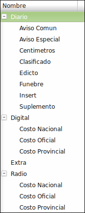
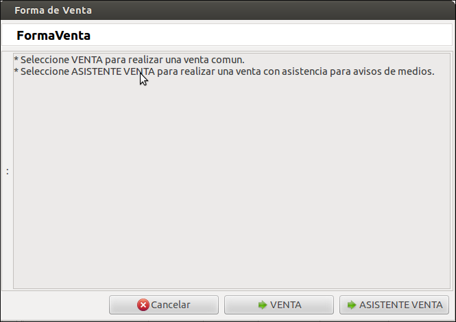
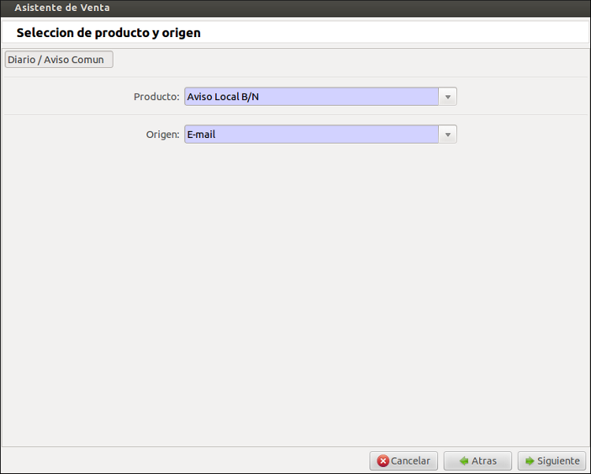
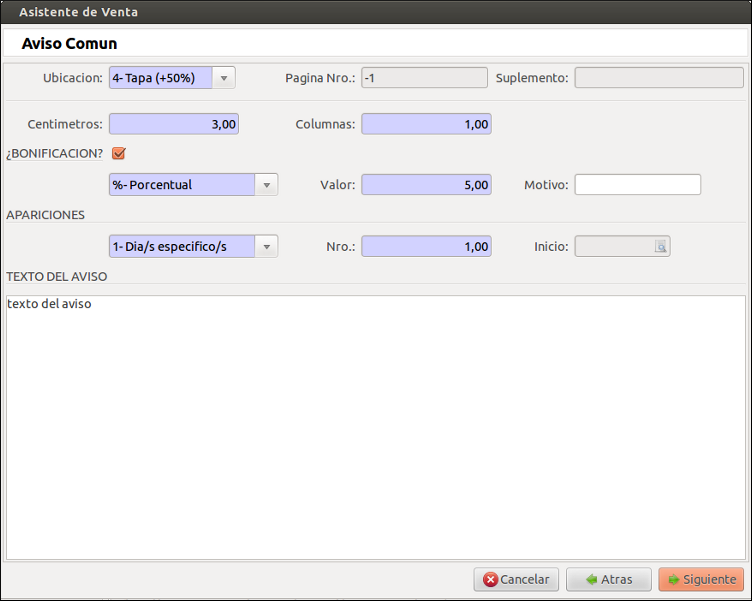
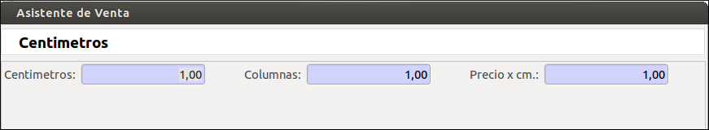
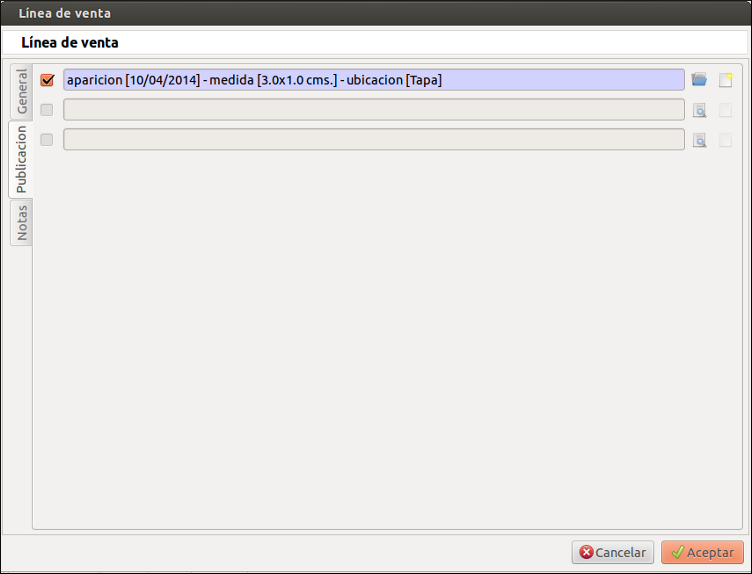

.. Documentacion DYPRA master file, created by
   sphinx-quickstart on Tue Apr 8 11:57:59 2014.
   You can adapt this file completely to your liking, but it should at least
   contain the root `toctree` directive.

Documentacion DYPRA
===================

.. toctree::
   :maxdepth: 2

Introducción
============

Las modificacioens, adaptaciones y modulos que se detallan a continuacion se realizaron sobre sobre el ERP Tryton 3.0 para Medios El Independiente Coopegraf Ltda de La Rioja. Manteniendo estandares y genericidad para que pueda replicarse y reusarse en otros medios similares.

Modificaciones y Adaptaciones
=============================

Producto
--------

El modulo Producto posee las categorías y productos necesarios para la gestion de medios:

   * Diario:
       * Aviso Común
       * Aviso Especial
       * Clasificado
       * Funebre
       * Edicto
       * Suplemento
       * Insert
       * Centímetros
   * Radio:
	   * Costo Provincial
	   * Costo Nacional
	   * Costo Oficial
   * Digital:
	   * Costo Provincial
	   * Costo Nacional
	   * Costo Oficial

Ademas se provee un fichero que inserta los productos correspondientes en cada tipo, con su precio de lista, precio de costo ($0 ya que son servicios) e impuestos asociado. Asi como un producto especial, "Bonificacion" provisto para facilitar descuentos en las ventas.

En cuanto a unidades de medida de los productos estan provistos:

   * cm: Para los productos de tipo Aviso Común, Clasificado Destacado, Fúnebre Destacado.
   * línea: Para los productos de tipo Clasificado por Línea
   * página: Para los productos de tipo Suplemento Módulo Completo.
   * unidad: Para los productos de tipo Aviso Especial, Edicto Judicial, Insert, Radio y Digital.

Entidad
--------

El modulo Entidad provee las categorías necesarias para registrar clientes para areas de Efectivo y Cuenta Corriente, del siguiente modo:

   * Cliente
   * Cliente/Particular
   * Cliente/Cuenta Corriente
   * Cliente/Cuenta Corriente/Comisionista
   * Cliente/Cuenta Corriente/Particular
   * Cliente/Cuenta Corriente/Oficial

Ademas se agrego el campo DNI para contemplarlo en los filtros de búsqueda, asi como el tipo de facturación que se le realizará al cliente (B o A) para distinguir los reportes de Facturas con IVA incluido o discriminado.

Ventas
------

La plantilla de ventas cuenta una pantalla inicial que permite la selección de uso de venta comun que es la que posee Tryton por defecto o ayudarse con el asistente de venta desarrollado.

La opción asistente venta es un wizard que consta de 4 o más pasos que facilitan los cálculos de ventas de avisos y contempla fechas de aparición de los mismos. 

En general, se puede seleccionar al principio el tipo de venta: Efectivo o Cuenta Corriente.

Y se sigue según sea:

   * Efectivo: 
Se busca un cliente asociado a ventas en efectivo, el tipo de servicio que se va a vender (Diario, Radio o Digital), y la categoría (como las mencionadas más arriba). Luego se pasa a seleccionar el producto (ya filtrado por lo elegido en el paso anterior) y el origen. De acuerdo al producto se registran datos particulares del aviso, como cantidades (cm x col, líneas, paginas o unidades),importes, ubicación, bonificación (porcentual y fija), texto que se desea publicar , y tipo de apariciones (Dia/s Específico/s, Semanal/es, Mensual/es o Anual), con lo cual se especifica la fecha de inicio, y en caso de ser días específicos como pueden ser discontinuos se pasa a seleccionar fecha por fecha lo cantidad requerida.

Paso 1

Paso 2

Paso 3

Paso 4

   * Cuenta Corriente:
Idem que en el caso de Efectivo, solo que se contempla algunas categorías de Diario, más una categoría especial que es Centimetros, para el caso que se vende una cantidad determinada de centímetros a cuenta corriente (especificando cantidad de cm, col, y precio por cm)

Al finalizar se habrá creado una venta en estado “Presupuesto”, con las líneas de venta (una por cada aviso vendido), mas una linea de venta de tipo comentario que contiene el texto a publicar y una línea adicional en caso de poseer bonificación que realiza el descuento sobre el importe total.

Cada línea de venta (de producto) posee una pestaña o apartado en la vista, que posee la publicación presupuestada asociada (ya sea para Diario, Radio o Digital), para que pueda modificarse algunos datos antes de confirmarse la venta.

En caso de confirmar la venta, si se trata de una venta en Efectivo se genera la factura asociada, y se pasan todas las publicaciones presupuestadas a las correspondientes publicaciones en el módulo de Edición (provisto con tal fin). Y a diferencia, cuando es por Cuenta Corriente, las facturas se generan recién cuando se marca como publicado dicho aviso.

Contabilidad
------------

La plantilla de facturas provee la posibilidad de elegir el tipo: A o B.
Ademas posee un reporte resumido de factura que colapsa las líneas de factura que provienen de las líneas de ventas de avisos semanales, mensuales o anuales para una mejor visualización. 
Y en caso de ser ventas del area de Cuenta Corriente la factura no se realiza al procesar la orden como generalmente se configura sino que se registran por aviso publicado.

Modulos añadidos
================

